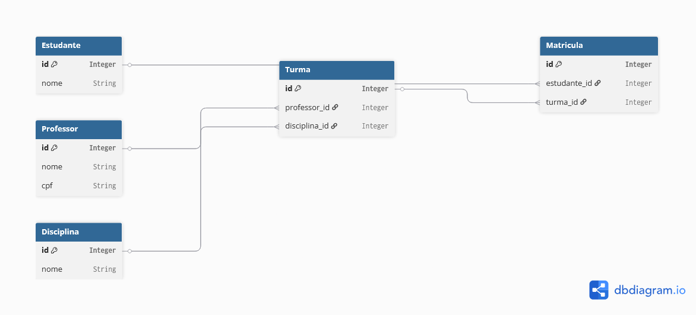

# sistema-academico

Aprendiz: Matheus de Camargo Gimenez

## Descrição

Sistema de gerenciamento acadêmico. 

Permite listar, criar, editar e excluir cadastros de:

- Estudantes
- Professores
- Disciplinas
- Turmas
- Matrículas

## Entidades relacionadas

## Classes

O sistema possui as seguintes classes que são utilizadas para representar as tabelas do banco:

- Estudante
- Professor
- Disciplina
- Turma
- Matricula

Também possui a classe **CPF** utilizada para representar e validar o CPF das entidades.

As classes ***Model** foram usadas para realizar as operações no banco de dados e gerenciar a ObjectList de cada entidade. São elas:

- EstudanteModel
- ProfessorModel
- DisciplinaModel
- TurmaModel
- MatriculaModel

Cada entidade conta com um modal para Inserir e Editar:

- FormEstudante
- FormProfessor
- FormDisciplina
- FormTurma
- FormMatricula